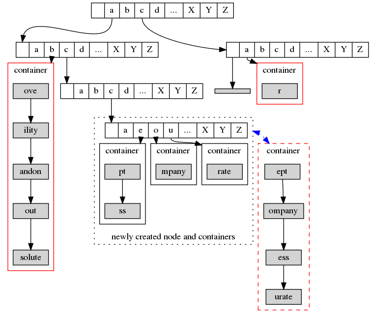

# 命名空间管理&元数据管理
## 1.介绍  
每个持久对象都由一个持久对象名唯一指定，但实际操作的是NVM上的地址，命名空间管理模块负责将一个持久对象名映射到一个持久对象的元数据，系统进而通过持久对象的元数据访问到持久对象的地址。系统处理对象名到元数据的映射可能会很频繁，所以要求命名空间管理性能越高越好。每个持久对象的元数据除了对象名之外，还包含用户、用户组等其他信息。
## 2.需要的基础和提供的接口
### 2.1需求
1.需要上一层提供字节粒度的持久内存分配与释放函数,以操作非易失内存。  
2.需要提供给我一个可以返回我记录全局信息结构的地址的函数。  
### 2.2提供
1.提供给上一层三个关于持久对象名操作的函数，上层可以通过这三个函数快速的新添、删除对象名并通过对象名快速的定位到持久对象的元数据信息。  
预计提供给上层函数的形式：
```C
struct pos_ns_record *pos_ns_search(const char *str, int str_length);
//查找一个持久对象名是否已经存在的函数，如果存在返回这个对象的record,不存在则返回null。
struct pos_ns_record *pos_ns_insert(const char *str, int str_legnth);
//创建一个新的持久对象名,如果持久对象已经存在或者申请内存失败返回null，插入成功则返回新纪录record的地址。
struct pos_ns_record *pos_ns_delete(const char *str, int str_length);
//删除一个持久对象名，删除成功返回被被删除record的地址，删除失败返回null。
```
我的上一层可以拿到一个持久的对象的描述符pos_descripter,需要操作持久对象元数据时修改pos_descropter中的对应数据即可。
```c
struct pos_descriptor
{
	struct list_head d_vm_list;//记录持久对象vma链表，vma链表与操作下一层实现，可以借助linux内核里的list嵌入式结构实现。
	unsigned long long prime_seg;//记录持久对象的首地址。
	uid_t	d_uid;//用户id
	gid_t	d_gid;//组id
};
/*暂时想到这些元数据项，如果有需要会继续添加*/
```
### 2.3使用说明
1.创建一个持久对象时，先根据持久对象名申请一个record，再申请一个descripter，把record指向descripter，最后把相应元输入填入descripter。  
2.删除一个持久对象时，先释放占用的空间，再free掉descripter，最后delete掉record。
## 3.总体设计
### 1.burst-trises  
使用burst-tries来实现命名空间管理模块,以达到快速找到元数据的目的。一个burst-tries由三种组件构成：记录、容器和访问字典树。  
1.记录：每个记录中包含一个字符串以及需要存储的具体数据或者具体数据的地址，所有记录中的字符串互不相同，每个字符串能够唯一确定一个记录。  
2.容器：容器是一系列记录由特定方式组织成的集合，组织方式可以是链表、二叉搜索树等能够在小数据集上有效插入和搜索的数据结构。对于一个深度为k的容器，其包含的所有记录中的字符串的长度都大于等于k，而且同一个容器中存储的字符串前k项都是相同的，所以不需要存储前k个字符。另外，每一个容器都有一个结构用来存储容器中记录的统计信息。  
3.访问字典树：访问字典树是一个字典树，它的叶子节点是容器。其每个节点都由一个数组p组成，数组p的大小为|A|，每个数组项都是一个指针，指针可以指向一个字典树节点、一个容器或者一个包含空字符串的记录。  
访问字典树的根节点深度定义为1，树的叶节点所在深度不受限制。  
一个简单的burst-tries如下图所示：


burst是用新的深度为k访问字典树节点t和深度为k+1容器来替换旧的深度为k的容器的过程:  
**Step1**：创建一个新的访问字典树节点t，其指针数组的每一个值都设为空，其深度为k。  
**Step2**：对于原始容器中的每一项记录，设其存储的字符串为ck+1ck+2...cn，将其进行以下步骤：  
(1)删除记录的第一个字符。  
(2)若是删除前字符串已经为空，则将其插入到新创建节点t的指针数组的第一个位置，若是删除后的字符串不为空，则根据ck+2在字符集A中的位置将新容器插入到t中。  
**Step3**：删除原来的容器。  


Burst-tries的访问字典树效率很高，但占用空间大，容器占用空间小，但搜索效率相对低下。从另一个角度来看，每个容器容量越大，burst-tries的空间占用越小，其效率越类似于链表，极限的情况下，容器无限大，所有记录都存在于一个容器中，那么burst-tries的时空复杂度与链表相同；而单个容器越小，需要的容器越多，burst-tries的空间占用越大，效率越类似于字典树，极限情况下，每个容器中仅存储一个记录，burst-tries将退化为字典树。  
Burst的价值在于它能使得burst-tries结合两种结构的优点，判定何时进行Burst则是控制burst-tries更偏向于哪个数据结构的关键，选择合适的burst判定机制才能满足实际应用中的空间、时间需求。  
暂时选择比较简单的burst判定方式：limit判定方式。当某个容器中的record数量超过某一个阈值时，就对其进行burst操作，这个阈值之后确定。  
limit判定方式能够限制单个容器的搜索总成本，但没有考虑到容器中不同位置记录访问的频繁程度。其他复杂一些的判定方式有考虑到，现阶段先实现第一种。
## 4.具体实现
### 4.1需要用到的数据结构
数据结构中不能定义指针，用到指针的地方全部使用物理地址来代替，物理地址使用unsigned long long来表示。之后实现过程中可能会有频繁的物理地址与指针转换，指针和物理地址的使用习惯很不一样（例如unsigned long long无法像指针一样指向下一个相邻位置),有点不太方便。而且命名最好易于辨认一些，因为所有地址都变成了unsigned long long，命名不好辨认的话即便找到定义也难以理解指向的是什么结构。   
1.定义一个记录全局信息的结构pos_super
```c
struct pos_super
{
	unsigned long long trie_root;//trie node根结点
	int ns_count //持久对象数量
	int trie_node_count //trie node节点数
	int trie_container_count //container数量
}
```
2.定义trie_node
```c
struct pos_ns_trie_node
{
	int depth;			//这个结构体中必须放在第一个，有其他用途（判断），创建po时检查长度是否超过128 
	unsigned long long  ptrs[POS_ARRAY_LENGTH];//pos_array_length暂定128字符，'/'应该是不支持的,预想不用改变其他字符在数组中的位置，若有需要可以直接在'/'字符位置作其他用途，创建po时检查是否含有'/'
};
```
3.定义container
```c
struct pos_ns_container
{
	unsigned long long head;	//指向容器中的第一个record 
	int cnt_limit; //记录容器中记录的数量
	/*以后扩展burst方式可能会用得到的结构*/
	//int cnt_accesses;
	//int cnt_direct_hits;
	//int cnt_capital;
};
```
4.定义与每个descripter对应的record
```c
struct pos_ns_record
{
	int str_length;//record中的字符串长度，注意，是去掉前缀后的
	char *str;//去掉前缀后的字符串剩余字符
	unsigned long long desc;//指向每个record对应的descripter
	unsigned long long next;//同一个container中的recorder用单链表组织
};
```
### 4.2需要实现的函数
1.需要向上层提供的，2.2已经列出
```c
struct pos_ns_record *pos_ns_search(const char *str, int str_length);
struct pos_ns_record *pos_ns_insert(const char *str, int str_legnth);
struct pos_ns_record *pos_ns_delete(const char *str, int str_length);
```
2.还需要定义的
```c
void pos_ns_init()
```
初始化时的函数，初始化时就建立一个trie根节点，并初始化其他全局信息，只有系统初始化时会调用一次这个函数。
```c
struct pos_ns_record *pos_ns_search_container(stuct pos_ns_container *container,int depth,const char *str,int str_len)
```
在容器中搜索某条记录的函数，调用pos_ns_search时有可能用到，也可能用不到，因为一个record可以在container中，也可以直接在一个trie_node下,返回值为空或record的地址。传入depth函数的目的是可以利用&&短路让比较快一些。
```C
void pos_insert_record(struct pos_ns_container,struct pos_ns_record);
```
这个函数是将一个record插入到container中，pos_ns_insert时有可能会调用这个函数，也有可能不会调用，原因同上,若可在trie_node下直接插入即可
```c
struct pos_ns_record *pos_ns_delete_record(struct pos_ns_container *container,int depth,const char *str,int str_length)
```
在容器中删除一个记录，同样不一定会被调用，返回被删除的地址或空
```c
int pos_ns_need_burst(struct pos_ns_container *container)
```
判定是否需要burst的函数，到时候可以用宏定义的方式选择判定方式。若是需要burst返回1，不需要burst返回0。
```c
void pos_ns_burst(struct pos_ns_trie_node *prev_trie_node,int prev_index)
```
burst的函数，传入的时容器连接的trie_node节点和容器所在的index，如果传入container难以向前找到trie_node。
## 5.其他
1.预想初始化的时候就建立一个节点，这样就不用每次运行时都判断。  
2.补充其他两种burst判定方式：  
Ratio判定方式，根据直接命中率是否达到阈值进行判断是否需要burst，这种判定方式还需要设定一个判定开始生效的值，能够考虑到不同位置元素访问的频繁度，但需要两个计数器，分别是访问次数和直接命中次数。  
Trend判定方式，初始设定一个值，根据访问和元素增删修改这个值能够考虑到容器大小和访问频繁度，只需要一个计数器，但实现比较难，而且参数值难以确定。
